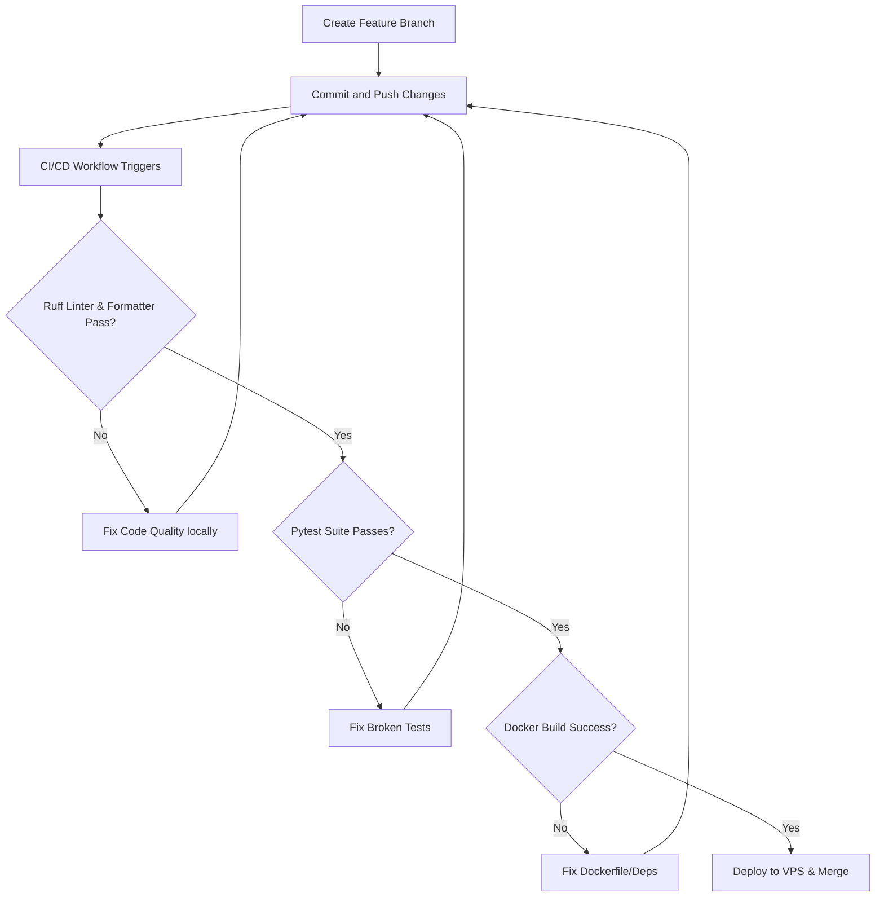

# TangerangCast 🌦️

*TangerangCast* is a cutting-edge, machine learning-powered weather forecasting and geospatial visualization platform specifically designed for Tangerang, Banten, Indonesia. 

By fetching live meteorological variables from the Open-Meteo API, TangerangCast feeds this high-resolution data into an advanced **Stacking Ensemble Machine Learning Model** (comprising XGBoost, LightGBM, CatBoost, and a Logistic Regression meta-model). It then visualizes real-time and forecasted rain probabilities across a granular 20x20 geographical grid, refreshed automatically every 6 hours.

---

## 🚀 Key Features

* **🌐 Automated High-Resolution Grid Pipeline:** An automated scheduler seamlessly fetches, batches, and ingests live meteorological data across a granular 20x20 geographical grid covering Tangerang.
* **💾 Robust Local Data Lake:** Clean separation of data tiers (`historic`, `current`, `future`, and `temp`) using structured, immutable CSV files with time-based auto-cleanup.
* **🧠 Stacking Ensemble Architecture:** Real-time inference utilizes 4 highly-optimized, decoupled `.onnx` models (XGBoost, LightGBM, CatBoost + Meta LogReg) for exceptionally robust rain predictions.
* **🗺️ Geospatial Visualization Map:** An interactive Folium map visualizing rain zones, forecast overlays, and geographic risk levels in Tangerang.
* **📊 MLOps & Continuous Training (CT):** Integrated MLflow tracking with an automated weekly retraining pipeline hosted on GitHub Actions, hot-swapping live production models seamlessly via SSH/SCP.
* **🤖 Integrated CI/CD Automation:** Robust pipelines executing code style/formatting checks (Ruff), unit testing (pytest), and Docker VPS deployment on every branch push.

---

## 📁 Repository Structure

To maintain a clean and reliable codebase, the project follows this directory tree:

```text
TangerangCast/
├── .github/workflows/
│   ├── ci-cd.yml          # GitHub Actions CI/CD Pipeline (Lint, Test, Deploy to VPS)
│   └── ct-pipeline.yml    # Continuous Training (CT) Pipeline (Weekly ONNX Retrain & Hot Swap)
├── data/
│   ├── raw/               # Auto-fetched Raw Data (Historic, Current, Future, Temp)
│   └── processed/         # Structured, clean datasets for model training & analysis
├── models/                # Target directory for 4 serialized ML model weights (.onnx)
├── notebook/
│   └── EDA.ipynb          # Jupyter notebook with Exploratory Data Analysis
├── pages/
│   ├── data_insight.py    # Sidebar Page: ML Insights & Dataset Performance Analytics
│   └── live_map.py        # Sidebar Page: Real-time & Predictive Geospatial Folium Map
├── src/
│   ├── api_fetcher.py     # Background pipeline scheduling & Open-Meteo grid downloader
│   ├── preprocessor.py    # Data cleaning, normalization, and feature engineering logic
│   ├── inference.py       # Scoring pipeline driving 4 ONNX models for predictions
│   └── train.py           # Core training script generating the Stacking Ensemble & MLflow logs
├── tests/
│   └── test_api.py        # Pytest unit tests for validating pipeline components
├── Dockerfile             # Multi-stage production container configuration
├── app.py                 # Core Streamlit application entry point
├── requirements.txt       # Unified project dependency declaration
└── README.md              # Project documentation (You are here)
```

### 🔍 Core Module Mappings
For developers onboarding to the project, here are direct references to our core modules:
* 🛠️ **Application Core**: `app.py` handles high-level layout, page navigation, and configuration.
* 🛰️ **Data Ingestion**: `src/api_fetcher.py` automates connection pooling, batch queries, and rate-limiting retry protocols.
* 🔮 **Inference Engine**: `src/inference.py` loads the 4 ONNX Stacking Session models and delivers real-time predictions.
* 🤖 **Continuous Training**: `src/train.py` fetches the latest sliding-window data, retrains the 3 base models and meta-model, optimizes thresholds, exports ONNX, and logs to SQLite MLflow.

---

## ⚡ Data Pipeline & Architecture

The ingestion pipeline queries the Open-Meteo API over a granular geospatial bounding box enveloping Tangerang:
* **Latitude Range:** `[-6.36, -6.00]`
* **Longitude Range:** `[106.33, 106.77]`
* **Grid Resolution:** 20x20 coordinates (400 data points per interval)
* **Timezone Config:** `Asia/Jakarta` (GMT+7)
* **Variables Extracted:** `temperature_2m`, `relative_humidity_2m`, `cloud_cover`, `surface_pressure`, `wind_speed_10m`, and `rain`.

---

## 🐳 How to Run Locally (Using Docker)

Docker is the recommended way to run TangerangCast, ensuring a pre-configured, immutable environment containing all spatial libraries, machine learning packages, and Python runtime tools.

### 📋 Prerequisites
* Verify that **Docker Desktop** is installed and actively running on your machine.

### 🛠️ Execution Steps

#### 1. Build the Docker Image
Navigate to the root of the project directory in your terminal and execute:
```bash
docker build -t tangerangcast .
```
> [!TIP]
> The initial build may take 1 to 3 minutes as it downloads packages and builds dependencies. Subsequent builds are near-instant due to Docker layer caching.

#### 2. Spin up the Container
Run the container and expose Port 8501 to access the dashboard:
```bash
docker run -p 8501:8501 tangerangcast
```

#### 3. View the Dashboard
Once the container starts, launch your browser and visit:
👉 **[http://localhost:8501](http://localhost:8501)**

#### 4. Terminate the Server
To shut down the running server and container, press `CTRL + C` in your active terminal session.

---

## 🐍 Local Development Setup (Manual)

If you prefer to run or debug the application directly on your local system without Docker, follow these steps:

### 1. Initialize Virtual Environment
```bash
# Create the environment
python -m venv venv

# Activate on Windows Powershell/Command Prompt
.\venv\Scripts\Activate.ps1   # Powershell
.\venv\Scripts\activate.bat   # CMD

# Activate on Linux/macOS
source venv/bin/activate
```

### 2. Install Project Dependencies
```bash
pip install -r requirements.txt
```

### 3. Run Quality Control & Tests
We keep code clean and error-free using [pytest](https://docs.pytest.org/) and [Ruff](https://github.com/astral-sh/ruff):
```bash
# Run the test suite
pytest tests/

# Check for lint issues
ruff check .

# Apply auto-formatting
ruff format .
```

### 4. Run the Streamlit Application
```bash
streamlit run app.py
```

---

## 🛠️ Git Team Workflow & CI/CD Rules

We use a strict branching and automated CI/CD protocol to maintain a highly stable, production-grade main codebase. **Do NOT push directly to the `main` branch.**

### 🔀 Branching Strategy
Create a dedicated feature branch for any task you work on:
```bash
# Example: Creating a branch for a frontend visual feature
git checkout -b frontend-map
```

### 🚀 Pull Request Protocol


1. **Commit & Push:** Once your feature code is written, push it to your remote feature branch.
2. **Automated Verification:** Our custom GitHub Actions workflow (`.github/workflows/ci-cd.yml`) automatically runs on every push to verify:
   * **Ruff Linter:** Enforces formatting rules and stylistic standards.
   * **Ruff Formatter:** Ensures uniform, clean code representation.
   * **Pytest:** Runs all pipeline unit tests.
   * **Docker Build & VPS Deploy:** Confirms the container builds successfully and seamlessly ships the live Docker build to the VPS.
3. **Continuous Training:** Our CT Pipeline (`.github/workflows/ct-pipeline.yml`) runs weekly via cron to pull live VPS data, retrain all 4 ONNX models on GitHub infrastructure, and hot-swap them into production using SCP/SSH.

---

## Guidelines for Machine Learning Engineers

* **Model Storage:** All finalized serialized models (strictly `.onnx` files) must be exported inside the `models/` directory using the unified names: `xgboost_model.onnx`, `lightgbm_model.onnx`, `catboost_model.onnx`, `meta_model.onnx`.
* **Git Restrictions:** 
  > [!CAUTION]
  > Since binary models and bulky raw/processed directories are blacklisted in our `.gitignore`, **do not** attempt to force-add these files to Git. Baseline datasets are hosted via Google Drive and queried automatically by the CT pipeline runner.
---
